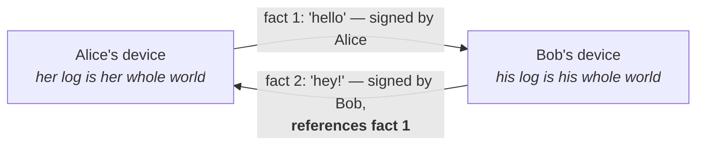

# Chapter 1 — Two people

`Classroom tier — chapter skeleton (scaffold landed RUN-13; beats from alpha/classroom/00-arc.md).
Prose bodies: DRAFT-PENDING (written in conversation, not by runs).`

## NEED

> Arc beat: remember what was said, without either owning the record.

DRAFT-PENDING (written in conversation, not by runs).

## STORY

> Arc beat: Alice and Bob talk. Each keeps their own notebook. Nobody's notebook is "the" notebook.
> Real-world: any conversation; "you said yesterday" works without a timestamp server.

DRAFT-PENDING (written in conversation, not by runs).

## DIAGRAM

## PRECISE STATEMENT

> Arc beat (mechanism): canonical local state; a statement is a fact signed by its author; "as you
> said before" is a hash reference — ordering by who-references-whom, no clock anywhere.

DRAFT-PENDING (written in conversation, not by runs).

## PROVE-IT

Every claim this chapter makes ends in something you can run:

- **Duplicate or reorder the facts — the record doesn't change.** `dedup.rs`
  (content-addressed dedup is idempotent under duplication/reorder) — evidence map row §6.6.4,
  `beta/drystone-spec/EVIDENCE-MAP.md`.
- **Both notebooks fold to the same bytes, whatever order the facts arrive in.** `convergence.rs`
  (two devices fold to one; byte-identical folds across arrival orders) — evidence map rows
  §4.1–4.6 and §7.3.2 (order-independence).
- Run it: `cd alpha/experiments/croft-chat && cargo test -p croft-chat --test dedup --test convergence`

## REFRAIN

*"And underneath, nothing changed: it is still two people keeping their own memory of what was
said, signing it, and pointing at each other's words."*
