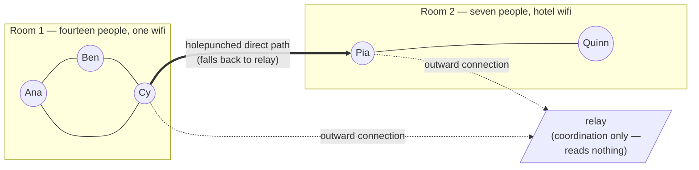

# Chapter 5 — The split room

`Classroom tier — chapter skeleton (scaffold landed RUN-13; beats from alpha/classroom/00-arc.md).
Prose bodies: DRAFT-PENDING (written in conversation, not by runs).`

## NEED

> Arc beat: same club, two buildings.

DRAFT-PENDING (written in conversation, not by runs).

## STORY

> Arc beat: seven of the twenty-one travel. Hotel wifi. The two rooms keep talking as one group; a
> new member in Room 2 is welcomed by someone in Room 1 and can immediately read.
> Real-world: any distributed family or team; the phone network carrying a call it cannot hear.

DRAFT-PENDING (written in conversation, not by runs).

## DIAGRAM

## PRECISE STATEMENT

> Arc beat (mechanism): NATs and why devices can't just dial each other; the relay (coordination
> only, reads nothing); holepunching with relay fallback; the Welcome crossing a real wire; the
> group object never noticing the room boundary (continuity lives in the lineage).

DRAFT-PENDING (written in conversation, not by runs).

## PROVE-IT

Every claim this chapter makes ends in something you can run — and one honest rung not yet held:

- **A real Welcome crosses a real wire; both sides derive the same epoch secret.**
  `alpha/experiments/iroh/crates/mls-welcome-over-iroh` (real openmls Welcome over real iroh;
  RUN-08 re-proof, `relay-lab-runs/C-mls-welcome-2026-07-15-run08`) — evidence map row §10.5 (a),
  `beta/drystone-spec/EVIDENCE-MAP.md`.
- **The group never notices the boundary: membership continuity survives the re-plant.**
  `e12_7_1_stamp_tracks_derivation.rs` / `e12_7_2_removal_propagates.rs` /
  `e12_7_3_unauthorized_no_drift.rs` (real openmls 0.8.1) — evidence map row §7.6.2 (membership
  half, `Verified`).
- **The in-flight conversation survives too — no loss, no duplication.**
  `e12_2_message_continuity.rs` (RUN-09) and `iroh_message_continuity.rs` (the four claims over
  real iroh-gossip, RUN-12) — evidence map row §7.6.2 (message half, `Modeled`, loopback).
- **The honesty lesson, taught by name:** the one arrow not yet proven on real routers is register
  row `hermetic-gossip` (`alpha/experiments/SPEC-DIVERGENCE-REGISTER.md`) — the live-gossip tests
  run at loopback; the relay/holepunch path across real NATs is X1, a rung the field still owes.
  The classroom shows the ladder, not just the rungs we hold.
- Run it: `cd alpha/experiments/replant-continuity && cargo test`
  and `cd alpha/experiments/croft-chat && cargo test -p croft-chat --test iroh_message_continuity`

## REFRAIN

*"And underneath, nothing changed: it is still two people keeping their own memory of what was
said, signing it, and pointing at each other's words."*
