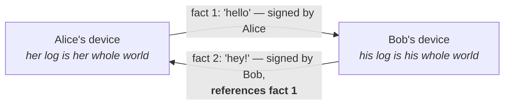
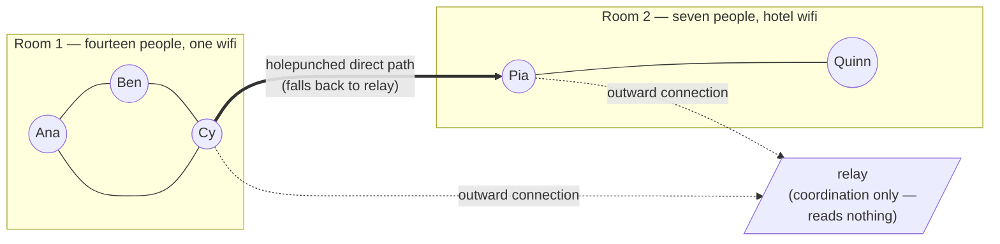

# Classroom seed diagrams (RUN-13 Part 3.2)

Drop each fenced block into its chapter skeleton's DIAGRAM beat, verbatim. These are the two seeds;
every other chapter's DIAGRAM beat stays a placeholder until its prose is drafted in conversation.

## Chapter 01 — Two people in a room: no clock, only who-references-whom

## Chapter 05 — The split room: the group never notices the boundary

Both blocks validated in Mermaid as drawn (flowchart LR; circles, subgraphs, dotted/thick edges,
HTML line breaks in labels). If the site's chosen renderer version rejects the ` `/`<i>`/`<b>`
label markup, simplify the labels to plain text rather than changing the graph shape, and note the
simplification in the summary.
